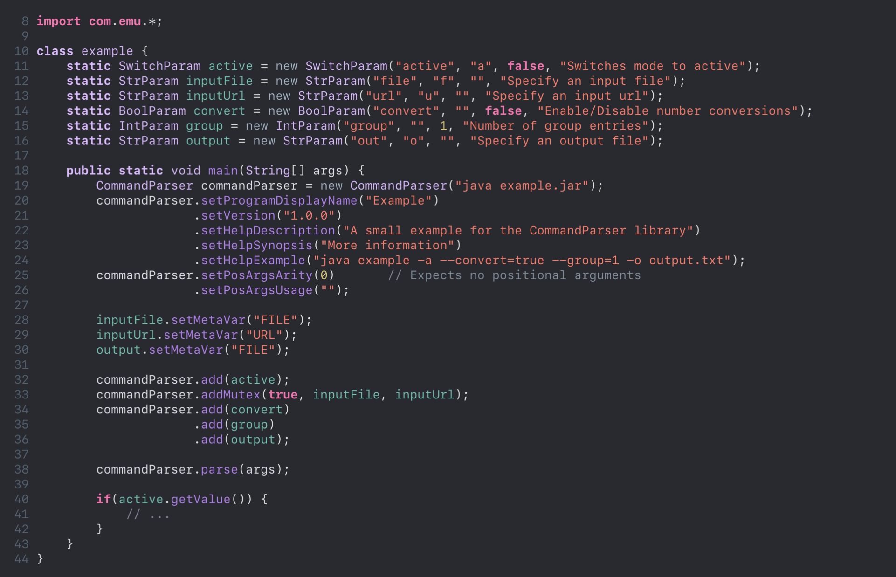
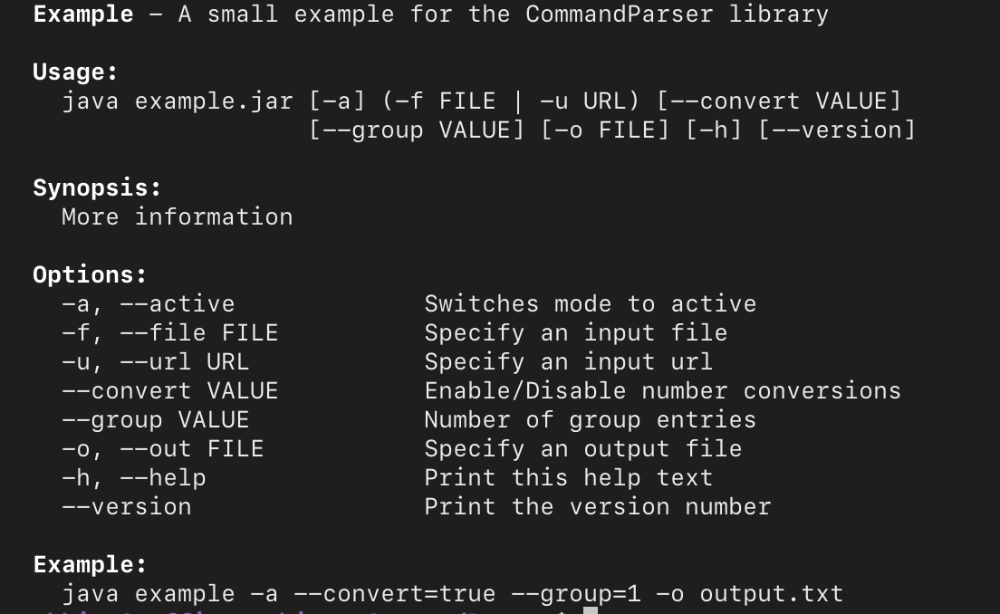

CommandParser
======

CommandParser is a small Java library for parsing command line arguments and generating help text.  
For more information take a look at [example.java](https://github.com/NoHitzz/CommandParser/blob/main/src/example.java) and [CommandParser.java](https://github.com/NoHitzz/CommandParser/blob/main/src/com/emu/CommandParser.java).

  
   

Features
--------------------

- Array parameters
- Required parameters
- Mutually exclusive parameters
- Parameter validation
- Auto-generated help text
- Custom parameters
- No external dependencies

Not Supported
--------------------

- Sub-commands

