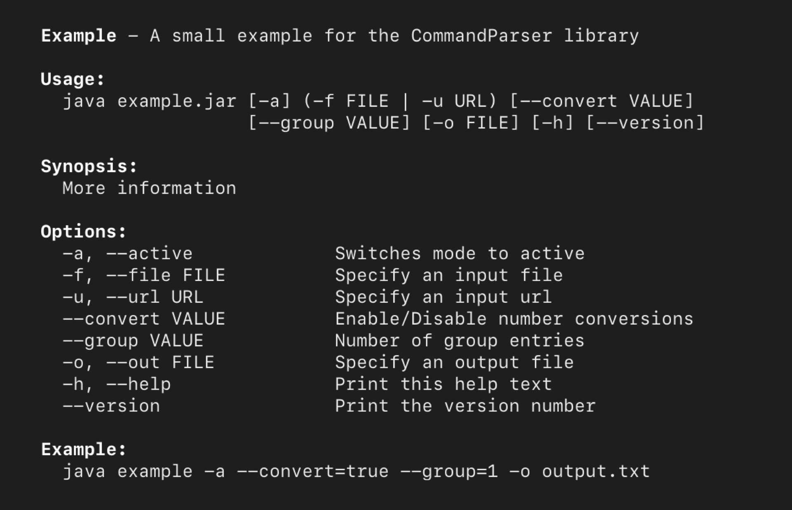

CommandParser
======

CommandParser is a small Java library for parsing command line arguments and generating help text.

  
   

Features
--------------------

- Array parameters
- Required parameters
- Mutually exclusive parameters
- Parameter validation
- Auto-generated help text
- Custom parameters
- No external dependencies

Not Supported
--------------------

- Sub-commands

